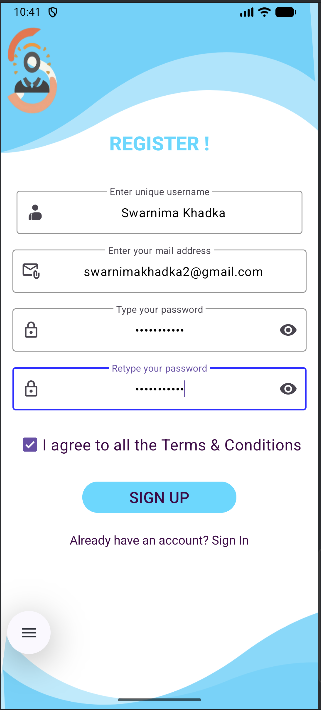
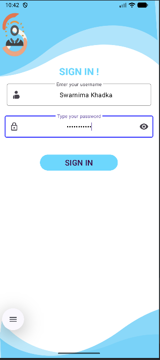
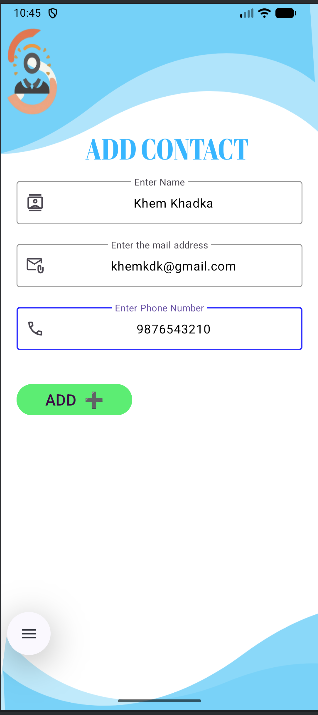
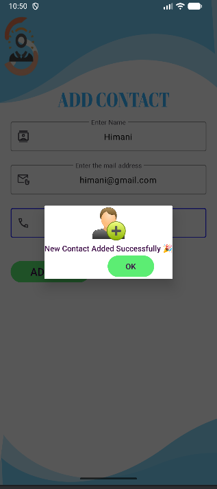

# AndroidLearnings_ContactManagement
This is a beginner Android practice project where I have implemented the core concepts I have learned so far. It includes a splash screen, user authentication with Sign Up and Sign In using a local database, and a main activity to add contacts whose details are stored in the database. A custom dialog confirms when a new contact is successfully added.

## 📸 Screenshots

|Splash Screen |SignUp Activity |SignIn Activity | Input Screen |DialogBox PopUp |
| :---:| :---: | :---: | :---: | :---: |  
| | | |  |  |

**To clone the repository:**
   ```bash
git clone https://github.com/Swarnima-Khadka1/AndroidLearnings_ContactManagement.git
